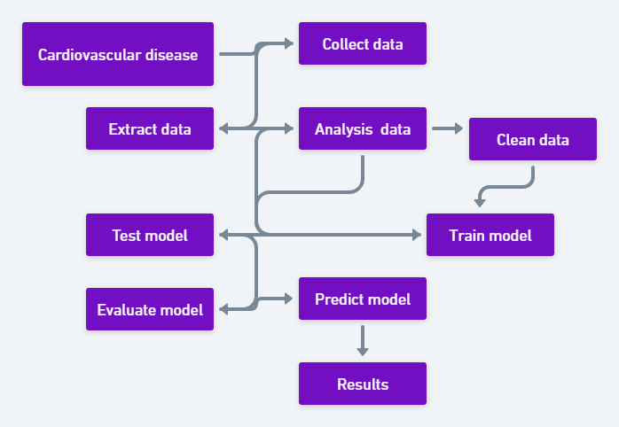

# The factors of Cardiovascular disease

## There are 3 types of input features

``` Data description
1. Objective: factual information
2. Examination: results of medical examination1
3. Subjective: information given by the patient
```

## Features

```Features
1. Age | Objective Feature | age | int (days) |

2. Height | Objective Feature | height | int (cm) |

3. Weight | Objective Feature | weight | float (kg) |

4. Gender | Objective Feature | gender | categorical code |

5. Systolic blood pressure | Examination Feature | ap_hi | int |

6. Diastolic blood pressure | Examination Feature | ap_lo | int |

7. Cholesterol | Examination Feature | cholesterol |
    1: normal, 
    2: above normal, 
    3: well above normal 

8. Glucose | Examination Feature | gluc | 
    1: normal
    2: above normal
    3: well above normal

9. Smoking | Subjective Feature | smoke | binary |

10. Alcohol intake | Subjective Feature | alco | binary |

11. Physical activity | Subjective Feature | active | binary |

12. Presence or absence of cardiovascular disease | Target Variable | cardio | binary |

All of the dataset values were collected at the moment of medical examination.
```

### Blood pressure is measured using two numbers

``` Blood pressure
The first number, called systolic blood pressure, measures the pressure in your arteries when your heart beats, 
Normnal: Systolic blood pressure is 12o mmHg(millimetre of mercury) or below  
Systolic blood pressure | Examination Feature | ap_hi | int |
```

### Diastolic blood pressure | Examination Feature | ap_lo | int |

```Diastolic
The second number, called diastolic blood pressure, measures the pressure in your arteries when your heart rests between beats. This is the time when the heart fills with blood and gets oxygen. This is what your diastolic blood pressure number means:

Normal: Diastolic blood pressure 80 mmHg(millimetre of mercury) or below 
```

## Cardiovascular disease Flowchart

```Heart Disease Flowchart
```



